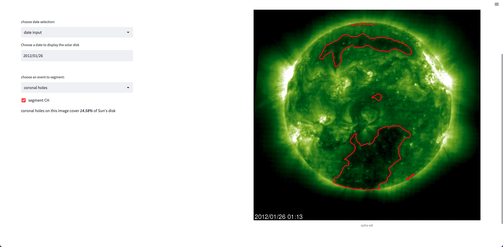

## Deep learning for segmentation on SOHO images

### ABSTRACT
(todo)   

more details about code are in markdowns and docstrings

- [prerequisites](prerequisites/) contains steps for downloading data and installing necessary libraries
- after downloading images provided in [prerequisites notebook](prerequisites/prerequisites.ipynb), [data folder](data/) should contain images for this project
- [modeling folder](modeling/) contains notebooks used for analysis regarding segmentation of active regions and coronal holes
- [src folder](src/) contains SCSS-net convolutional neural network from https://arxiv.org/pdf/2109.10834.pdf 
- [preprocessing folder](preprocessing/) contains code and scripts to preprocess data. There is no need for user to run those scripts again.
- [webapp folder](webapp/) contains files for simple web based interface with user. In this web interface, user can browse images and view segmentations of coronal holes or active regions on those images. To run webapp, download data provided in [prerequisites notebook](prerequisites/prerequisites.ipynb), then navigate to webapp directory in terminal and run following line:
```console
Streamlit run webapp.py
``` 
Preview of webapp can be seen on image below

  
